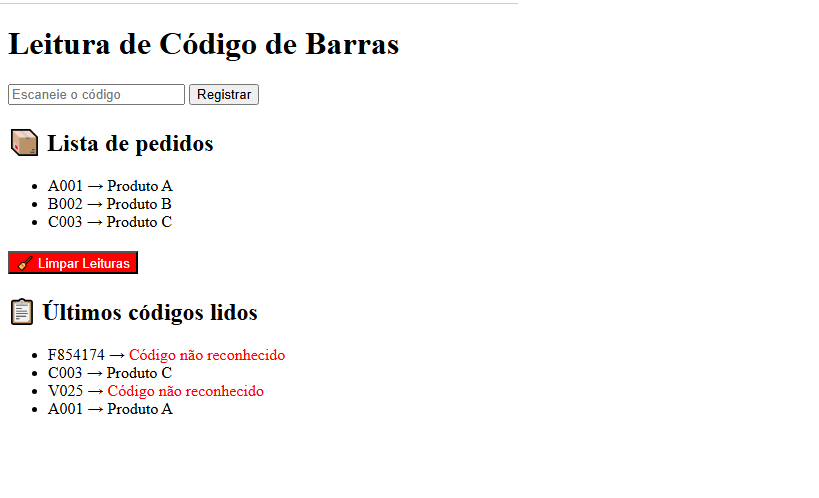
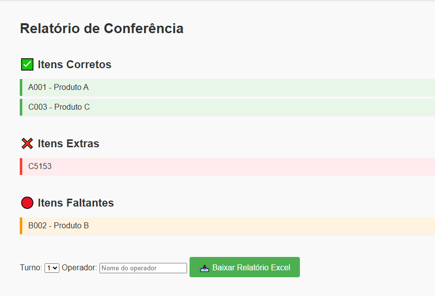
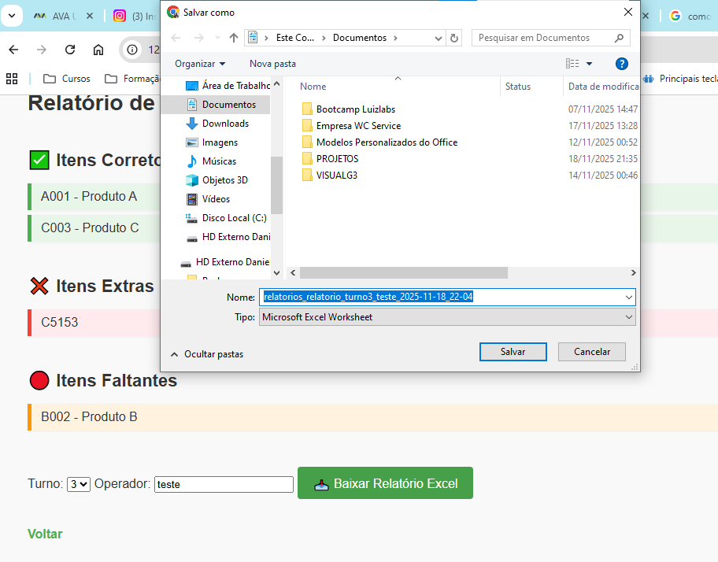

# 📦 WMS_WEB — Sistema de Gestão de Armazém

Sistema web para controle de pedidos, leitura de códigos, geração de relatórios e exportação em Excel. Desenvolvido com **FastAPI**, **Jinja2**, **SQLite** e **OpenPyXL**.

---

## 🗂️ Estrutura do Projeto

wms_web/
├── assets/              # Arquivos estáticos (imagens, CSS, JS)
├── static/              # Arquivos públicos servidos pela aplicação
├── templates/           # Páginas HTML (index.html, relatorio.html)
├── relatorios/          # Relatórios gerados
├── venv/                # Ambiente virtual Python
├── wms.db               # Banco de dados SQLite
├── main.py              # Ponto de entrada da aplicação FastAPI
├── criar_banco.py       # Script para criar o banco
├── criar_tabela.py      # Script para criar as tabelas
├── database.py          # Funções de acesso ao banco
├── exportador.py        # Exportação de relatórios
├── gerar_excel.py       # Geração de planilhas
├── iniciar_wms.bat      # Script para iniciar o sistema
├── requirements.txt     # Dependências do projeto

---

## 🚀 Como rodar o projeto

1. **Criar e ativar o ambiente virtual**
python -m venv venv
venv\Scripts\activate

- Instalar dependências
pip install -r requirements.txt

- Executar o servidor
uvicorn main:app --reload

- Acessar no navegador
http://127.0.0.1:8000

🖼️ Capturas de Tela
📥 Tela de registro de códigos 

📊 Tela de relatório 

📤 Exportação Excel 

📌 Funcionalidades
- Registro de códigos escaneados
- Visualização de histórico
- Relatório de conferência
- Exportação para Excel
- Limpeza da tabela de leituras

🛠️ Tecnologias
- Python 3.11+
- FastAPI
- Jinja2
- SQLite
- OpenPyXL

👨‍💻 Autor
Desenvolvido por Daniel — Aparecida de Goiânia, GO
